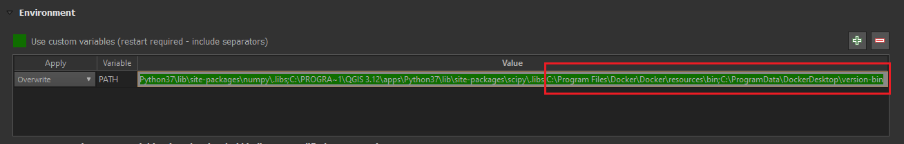
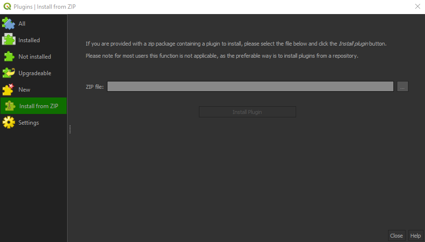
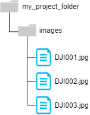

# QODM
An unofficial, experimental QGIS Plugin for UAV data processing using the power of OpenDroneMap.

This tool represents a graphical user interface to the commandline tool of OpenDroneMap (see [ODM website](https://www.opendronemap.org/odm/)) running in a local docker environment.

:information_source: Software is currently only tested on Windows 10 Home version 2004 (including WSL 2). Linux support should (with some tweaks) be given as long as the docker command is available in the QGIS environment.

## Installation Guide

### 1. Docker

OpenDroneMap runs docker. Depending on your operating system, make sure to download the right version and follow the detailed installation guide on following pages:

| Operating System          | Installation Guide                                               |
| ------------------------- | ---------------------------------------------------------------- |
| Windows 10 Pro/Enterprise | https://docs.docker.com/docker-for-windows/install/              |
| Windows 10 Home           | https://docs.docker.com/docker-for-windows/install-windows-home/ |
| Mac                       | https://docs.docker.com/docker-for-mac/install/                  |

Note, that for Windows 10 Home, a working WSL 2 (Windows subsystem for Linux) must be set up.
You can check, if docker is properly installed by using following command in the command prompt of your choice:

```
docker --version
```

### 2. QGIS Settings

In order to make Docker Desktop accessible from QGIS a few configuration steps are required.
Since QGIS overrides the PATH variable at every startup, docker hast to be added to the QGIS PATH variable manually.

Therefore open QGIS and navigate to *Settings > Options > System*.

In the Environment pane further down, check the box to use custom variables and click the plus sign.
For 'apply', set *'Overwrite'*, for 'variable' set *'PATH'* and concatenate the path with to the paths to your docker binaries (see Screenshot). Make sure to include separators.



### 3. QODM Plugin

After downloading the zip file from the QODM [release page](https://github.com/SandroGroth/QODM/releases), you'll be able to install the plugin directly via the QGIS Plugin Manager by selecting the Option *"Install from ZIP"*. Just reference the recently downloaded .zip archive and hit *'Install Plugin'*:



After successfully installing the plugin, it should be available under *Plugins > QODM > Process UAV Data*


## Processing UAV Data

After doing the tricky part of setting everything up, processing your drone data is fairly simple. 

### 01. Setting up the Data Structure

The most important part is putting your input data into the right folder structure, so that OpenDroneMap can recognize it properly.
Therefore you should at create an empty project folder, in this case *'my_drone_project'*, at a location of your choice. OpenDroneMap will will it with many more folders while processing. Inside this folder, add another folder called *'images'* (This folder MUST be named like this), where you place all your acquired UAV imagery that should be processed into one output product. The Project structure should now look something like this:



### 02. Execute Plugin

Open up QGIS and the QODM plugin and select the project folder, in this case 'my_project_folder' as project. Add an optional additional ground control points file and select an output coordinate system. Additionally, you can toggle the desired output products.


In the *'Advanced Settings'* pane, additional fine tuning parameters are supported. A detailed description on all supported parameters and even more flags and options can be found in the [OpenDroneMap Docs](https://docs.opendronemap.org/arguments.html).

Now you're good to go! Hit the OK button and grab a coffee, since processing can take quite some time.

# References

Ruggeri, Luca. “OpenDroneMap: Open Source Project for Processing Aerial Drone Imagery”, Open-Electronics.org, 27.12.2017.

OpenDroneMap (2020): Documentation. URL: https://www.opendronemap.org/docs/
